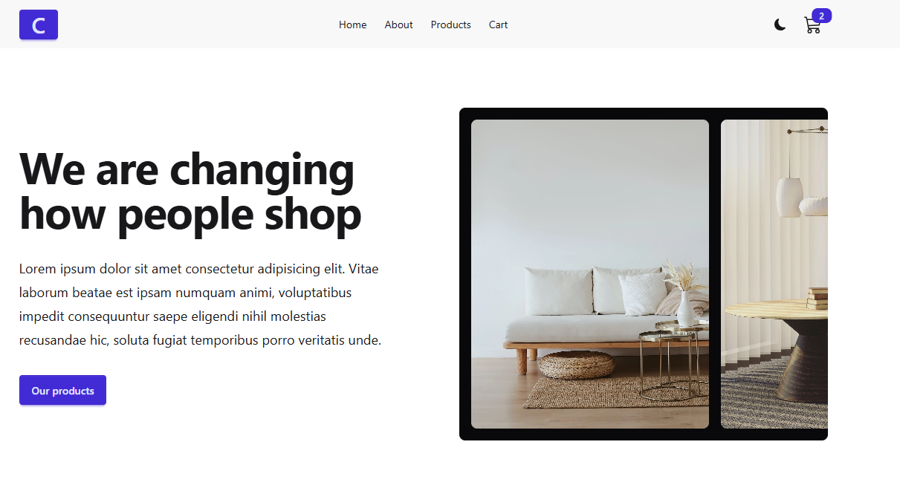
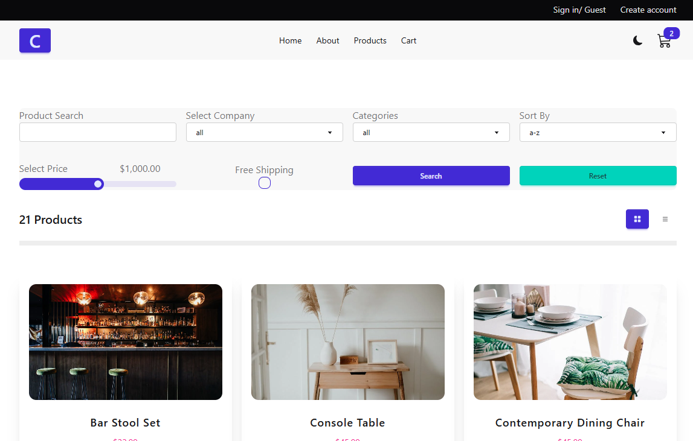
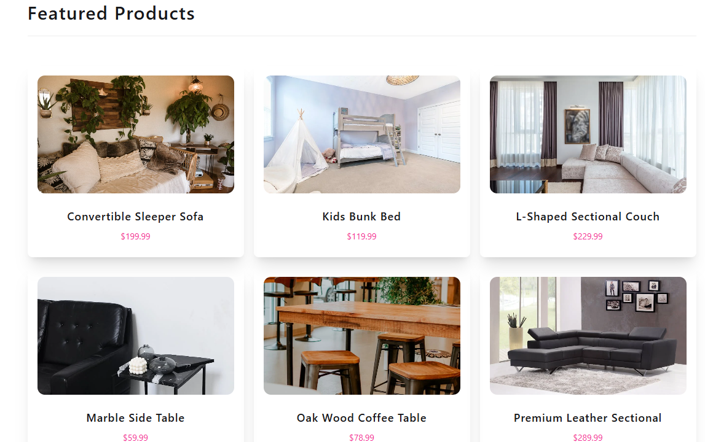
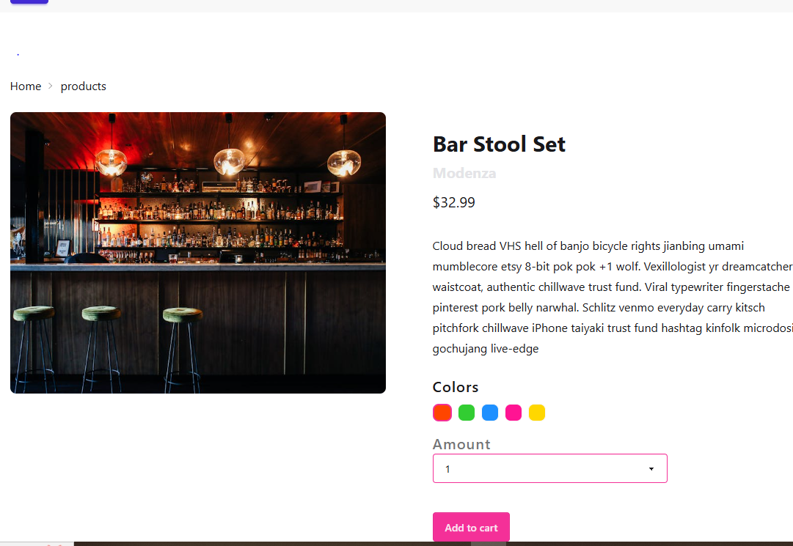
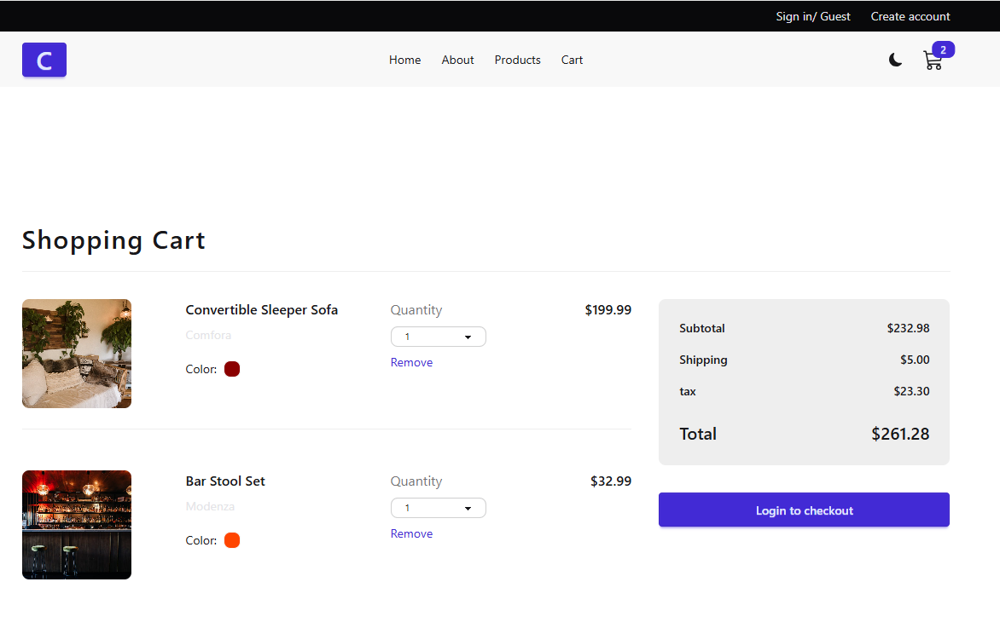
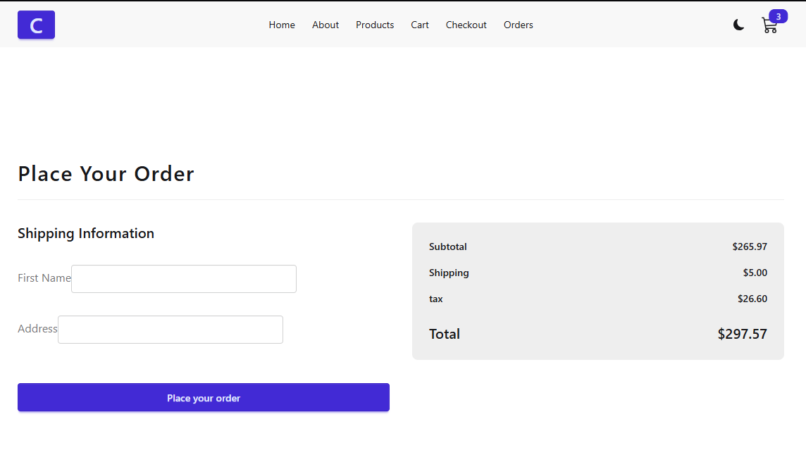
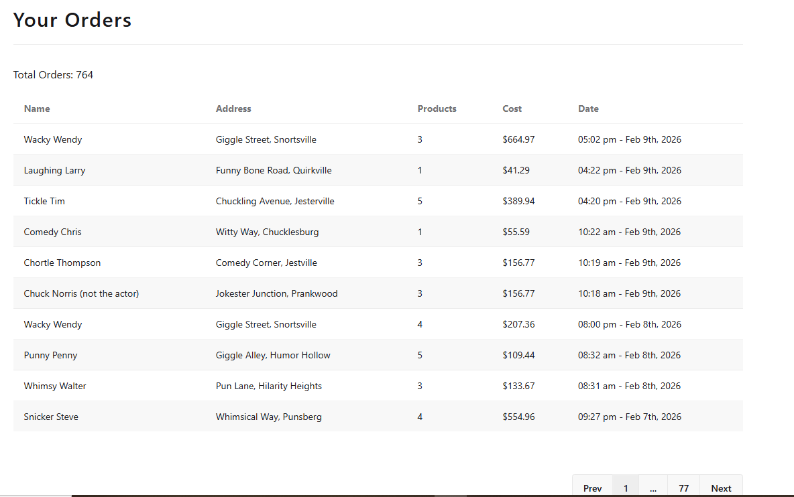

# 🛒 Shopping Web App

A **full-stack ecommerce application** built with modern web technologies. This project demonstrates product browsing, cart management, checkout flow, and order tracking — designed to mimic a real-world online shopping experience.

---

## 📌 Features
- 🏠 **Home page** with featured products  
- 🛍️ **Product listing** and detailed product view  
- 🛒 **Cart management** (add, remove, update quantities)  
- 💳 **Checkout flow** with order summary  
- 📦 **Order history** page  
- ⭐ **Featured products** section  
- Responsive design for desktop and mobile  

---

## 🛠️ Tech Stack
- **Frontend:** React (with hooks & context)  
- **Backend:** Node.js / Express (if included)  
- **Database:** MongoDB (if included)  
- **Styling:** CSS / Tailwind (depending on your setup)  
- **Deployment:** Netlify / Vercel  

---

## 🚀 Getting Started

### Prerequisites
- Node.js 18+  
- npm or yarn  

### Installation
1. Clone the repository:
   ```bash
   git clone https://github.com/erickomondi760/shopping-web-app.git
   cd shopping-web-app
   ```
2. Install dependencies:
   ```bash
   npm install
   ```
3. Run the app:
   ```bash
   npm start
   ```

---

## 📸 Screenshots

### Home Page
  
*Landing page with featured products.*

### Products Page
 
*Browse all available products.*

### Featured Section
 
*Highlighted products for quick access.*

### Product Detail
 
*Detailed view of a single product.*

### Cart Page
 
*Manage items in your shopping cart.*

### Checkout Page
 
*Complete your purchase with order summary.*

### Orders Page
 
*View past orders and track status.*

---

## 🧭 Workflow Demo

This walkthrough illustrates how a typical user interacts with the Shopping Web App:

1. **Start at the Home Page**  
  
*Discover featured products and navigate to categories.*

2. **Browse Products**  
       
   *Explore the full catalog of items.*

3. **View Featured Items**  
     
   *Quickly access highlighted products.*

4. **Check Product Details**  
     
   *See detailed information before adding to cart.*

5. **Add to Cart**  
     
   *Manage selected items, update quantities, or remove products.*

6. **Proceed to Checkout**  
     
   *Review your order and confirm purchase.*

7. **Track Orders**  
   
   *View your order history and track delivery status.*

---

## 🤝 Contributing
Contributions are welcome!  
1. Fork the repo  
2. Create a new branch (`feature-xyz`)  
3. Commit changes  
4. Open a Pull Request  

---

## 📜 License
This project is licensed under the MIT License.
